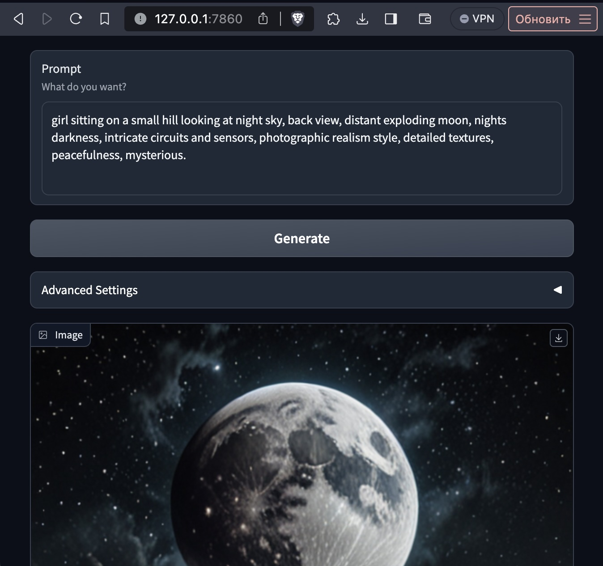

# Description:
The quickest and simplest method to taste the essence of Stable Diffusion XL. Conjured with a mere 100 lines of code and three magic buttons, this program summons models with an arcane auto-download feature. A five-step incantation leads to a spectacle of generation, supported on various mystical artifacts known as GPU, CPU, and MPS.
# Speed:
 - GPU renders the abstract into reality in a blink of an eye - a mere second.
 - MPS, the middle child, takes a brief few seconds to gather its thoughts.
 - CPU, the old sage, contemplates and formulates the visual enlightenment over dozens of seconds.
# Installation:
Invoke the command:
```
https://github.com/recoilme/100lineSDXL
cd 100lineSDXL
pip3 install torch torchvision torchaudio --upgrade
pip3 install -r requirements.txt
```
Ponder upon it (for a considerable duration).
# Commencement:
Utter the incantation:
```
python3 app.py
```
Bestow patience upon it (the inaugural ritual takes its sweet, sweet time, yes, once more).

# Interface:
Open link [http://127.0.0.1:7860/](http://127.0.0.1:7860/) behold the mystical canvas as this:


